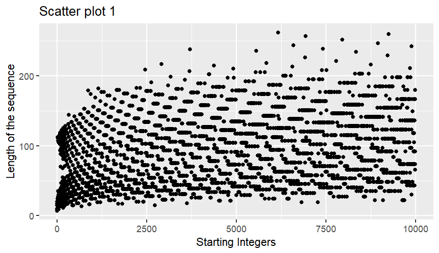
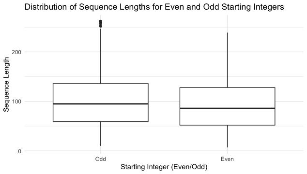
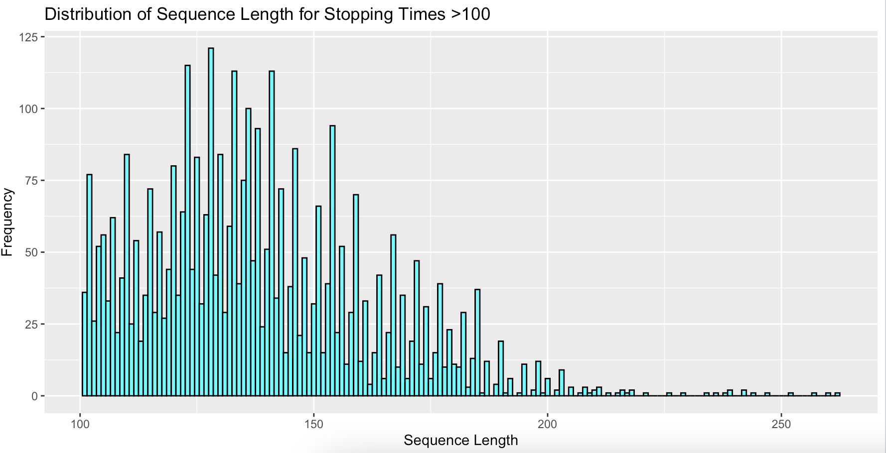
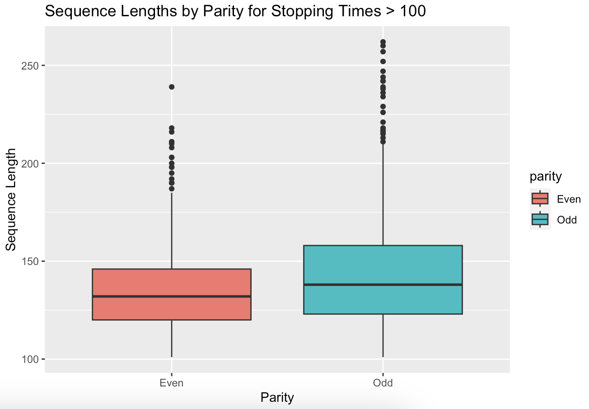
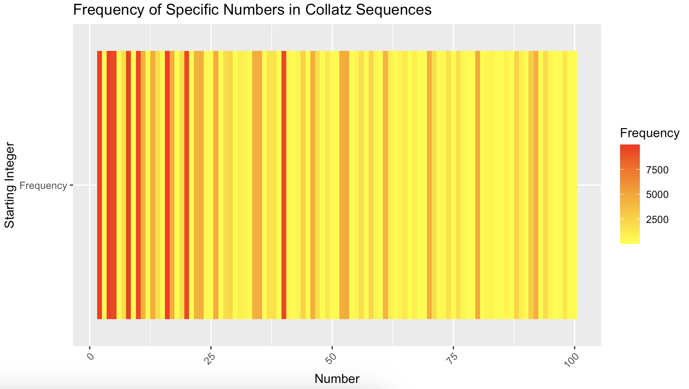
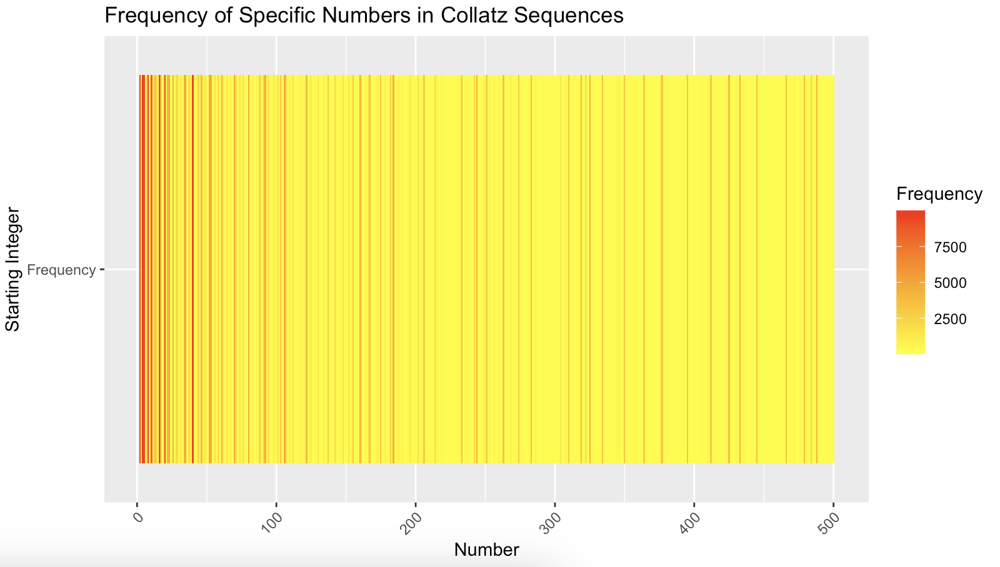

[Collatz Conjecture] {#sec-collatz-conjecture}

| Student ID \# | Name            |
|---------------|-----------------|
| 22B2046       | Syafiqah Raddin |
| 22B2125       | Izznie Adanan   |
| 22B2149       | Aqilah Rafidi   |
| 22B9014       | Bibi Junaidi    |

#### Contribution declaration

-   Task 1: Izznie Adanan
-   Task 2: Bibi Junaidi
-   Task 3: Syafiqah Raddin
-   Task 4: Syafiqah Raddin, Aqilah Rafidi, Bibi Junaidi
-   Task 5: Aqilah Rafidi 
-   Task 6: Izznie Adanan
-   README: Syafiqah Raddin, Izznie Adanan, Aqilah Rafidi, Bibi Junaidi

## 1) Generating the Collatz Conjecture

As instructed, I am creating a function 'gen_collatz' to generate the
Collatz sequence for a given positive integer 'n' and also implementing
a safeguard to handle invalid input values (non-positive integers).

```         
gen_collatz <- function(n) {
# SAFEGUARDING
  if (n <= 0 || !is.integer(n)) {
    stop("Input must be a positive integer.")
  }
  
  # Function to generate sequence for a single integer
  collatz_seq <- c(n)
  while (n != 1) {
  # For even integers
    if (n %% 2 == 0) {
      n <- n / 2
    } else {
    # For odd integers
      n <- 3 * n + 1
    }
    collatz_seq <- c(collatz_seq, n)
  }
  return(collatz_seq)
}

# Creating an empty tibble to store results
collatz_df <- tibble(start = integer(), seq = list(), length = numeric(), 
                     parity = character(), max_val = numeric())

# Using for loop to generate the sequences for integers from 1 to 10,000
for (i in 1:10000) {
  collatz_seq <- gen_collatz(i)
  collatz_df <- add_row(collatz_df, start = i, seq = list(collatz_seq),
                        length = length(collatz_seq), 
                        parity = ifelse(i %% 2 == 0, "Even", "Odd"), 
                        max_val = max(collatz_seq))
}
head(collatz_df)
print(collatz_df)
```

This would output:

```         
head(collatz_df)
# A tibble: 6 × 5
  start seq       length parity max_val
  <int> <list>     <dbl> <chr>    <dbl>
1     1 <int [1]>      1 Odd          1
2     2 <dbl [2]>      2 Even         2
3     3 <dbl [8]>      8 Odd         16
4     4 <dbl [3]>      3 Even         4
5     5 <dbl [6]>      6 Odd         16
6     6 <dbl [9]>      9 Even        16
```

I realized that this would only show a 6 x 5 tibble. So,

```         
> print(collatz_df)
# A tibble: 10,000 × 5
   start seq        length parity max_val
   <int> <list>      <dbl> <chr>    <dbl>
 1     1 <int [1]>       1 Odd          1
 2     2 <dbl [2]>       2 Even         2
 3     3 <dbl [8]>       8 Odd         16
 4     4 <dbl [3]>       3 Even         4
 5     5 <dbl [6]>       6 Odd         16
 6     6 <dbl [9]>       9 Even        16
 7     7 <dbl [17]>     17 Odd         52
 8     8 <dbl [4]>       4 Even         8
 9     9 <dbl [20]>     20 Odd         52
10    10 <dbl [7]>       7 Even        16
# ℹ 9,990 more rows
# ℹ Use `print(n = ...)` to see more rows
```

Now, we finally got the right tibble.

## 2) Exploratory data analysis

1. The top 10 starting integers.

```
sorted_collatz_df <- collatz_df %>%
  arrange(desc(length))

top10longest_matrix <- head(sorted_collatz_df, 10) %>%
  select(start) 
  
top10longest <- t(top10longest_matrix)

print(top10longest)
```

Output:
```
#>      [,1] [,2] [,3] [,4] [,5] [,6] [,7] [,8] [,9] [,10]
#> start 6171 9257 6943 7963 8959 6591 9887 9897 7422  7423
```

2. Starting integer produces a sequence that reaches the highest maximum value.
```
max_val_int <- collatz_df %>%
  filter(max_val == max(max_val)) %>%
  select(start)

max_val_int <- max_val_int$start

print(max_val_int)
```

Output:
```
#>[1] 9663
```

3.  The average length and standard deviation of the sequence for even and odd starting integers.

```
even_collatz <- collatz_df %>%
  filter(parity == "Even")
odd_collatz <- collatz_df %>%
  filter(parity == "Odd")
```

- To find the average length use the `mean` function for even and odd.
```
even_odd_avg_len <- c(mean(even_collatz$length), mean(odd_collatz$length))
print(even_odd_avg_len)
```

Output:
```
#>[1] 79.5936 92.3396
```
- Then, using the `sd` function to calculate the standard deviation.
```
even_odd_sd_len <- c(sd(even_collatz$length), sd(odd_collatz$length))
print(even_odd_sd_len)
```

Output:
```
#>[1] 45.10308 47.18387
```

## 3) Investigating "backtracking" in sequences

1.  Creating data frame of backtracking within the collatz sequences :

Filter out any sequence length that has less than 3 sequence since there
is no backtracking occurs.

```         
has_backtrack <- function(seq) {
  seq_length <- length(seq)
  if (seq_length < 3) {
    return(FALSE)
  }

  above_starting_value <- FALSE
```

- Iterate through the sequence starting from the second element.
- The sequence has gone above the starting value more than once.
- If the loop completes without returning TRUE, it means the condition was not met.

```         
  for (i in 2:(seq_length - 1)) {
    if (seq[i] < seq[1] && seq[i + 1] > seq[i]) {
      above_starting_value <- TRUE
    }
    
    if (above_starting_value && seq[i] > seq[1]) {
      return(TRUE)  
    }
  }
  
 
  return(FALSE)
  
}
```

Create an assignment of `backtracks_df` to create the data.

```         
backtracks_df <- collatz_df %>%
  group_by(start) %>%
  filter(any(sapply(seq, has_backtrack))) %>%
  ungroup()

head(backtracks_df)
print(backtracks_df)
```

Output:

```r         
backtracks_df
#> #A tibble: 8,229 × 5
#>   start seq        length parity max_val
#>   <int> <list>      <dbl> <chr>    <dbl>
#> 1     6 <dbl [9]>       9 Even        16
#> 2     7 <dbl [17]>     17 Odd         52
#> 3     9 <dbl [20]>     20 Odd         52
#> 4    10 <dbl [7]>       7 Even        16
#> 5    11 <dbl [15]>     15 Odd         52
#> 6    12 <dbl [10]>     10 Even        16
#> 7    13 <dbl [10]>     10 Odd         40
#> 8    14 <dbl [18]>     18 Even        52
#> 9    15 <dbl [18]>     18 Odd        160
#> 10    17 <dbl [13]>     13 Odd         52
#> # ℹ 8,219 more rows
```

2.  The most frequently occurring number of times they go above their
    starting integer.

```         
mode_backtrack <- backtracks_df %>%
  group_by(start) %>%
  summarise(
    most_common_count = max(table(sapply(seq, function(s) sum(s > start))))
  )

mode_backtrack <- mode_backtrack$most_common_count[which.max(mode_backtrack$most_common_count)]
print(mode_backtrack)
```

3.  The maximum value reached after the first backtrack for these
    sequences.

Using the `pmax` to find the maximum value of every integers.

```         
max_after_backtrack <- pmax(backtracks_df$max_val)
head(max_after_backtrack)

print(max_after_backtrack)
```

4.  The frequency counts for even and odd backtracking integers.

To find out what backtracking sequences more common among even or odd starting integers is by `sum`.

```         
even_frequency <- sum(backtracks_df$start %% 2 == 0)
odd_frequency <- sum(backtracks_df$start %% 2 != 0)

even_odd_backtrack <- c(even_frequency, odd_frequency)

print(even_odd_backtrack)
```

Output:

```         
#> [1] 3943 4286
```
From the outcome backtracking sequences more common among **odd** than even.

## 4) Visualisations

1. I have created a scatterplot of all the sequence lengths,where the        horizontal axis is the starting integer and the vertical axis is the      length of the sequence. 

```
ggplot(
  data = backtracks_df,
  mapping = aes(x = start,
                y = length)
) + geom_point() +
  labs(
    title = "Scatter plot 1",
    x = "Starting Integers",
    y = "Length of the sequence"
  )
```

 To identify the top 10 starting integers on the above scatterplot:
```
top_10_starting_integers_01 <- backtracks_df %>%
  group_by(start) %>%
  summarise(total_length = sum(length)) %>%
  arrange(desc(total_length)) %>%
  select(start) %>%  
  head(10)

print(top_10_starting_integers_01)
```
Output:
```r
#> top_10_starting_integers_01
#> #A tibble: 10 × 1
#>   start
#>   <int>
#> 1  6171
#> 2  9257
#> 3  6943
#> 4  7963
#> 5  8959
#> 6  6591
#> 7  9887
#> 8  9897
#> 9  7422
#>10  7423
```

 Below is the graph:
 


2. For the second part, since I have to highlight the top 10 starting   integers, we must create a new variable derived from the backtracks_df data frame.
```
top_10_starting_integers_02 <- backtracks_df %>%
  group_by(start) %>%
  summarise(total_max_val = sum(max_val)) %>%
  arrange(desc(total_max_val)) %>%
  select(start) %>%
  head(10)

print(top_10_starting_integers_02)
```

After identifying the top 10 starting integers, we then have to  highlight it in 10 distinct colours.
```
top_10_colors <- c(
  "start_int_1" = "pink",
  "start_int_2" = "cyan4",
  "start_int_3" = "red",
  "start_int_4" = "maroon",
  "start_int_5" = "blue",
  "start_int_6" = "yellow",
  "start_int_7" = "gold",
  "start_int_8" = "violet",
  "start_int_9" = "brown",
  "start_int_10" = "green"
)
```

Finally, we can create the scatterplot, where the horizontal axis is the starting integers and the vertical axis is the maximum value reached in the sequence. 
```
ggplot(
  data = backtracks_df,
  mapping = aes(x = start,
                y = max_val,
                color = top_10)
          
) +
  geom_point(
    size = 3
  ) +
  labs(
    title = "Scatter plot 2",
    x = "Starting integers",
    y = "Maximum value reached in the sequence",
  ) +
  scale_color_manual(values = c("FALSE" = "darkgray", "TRUE" = "pink"))
```


3.  Create a boxplot comparing the distributions of sequence lengths for
    even and odd starting integers. Are there any noticeable
    differences?
    
```
backtracks_df$seq_length <- sapply(backtracks_df$seq, length)

ggplot(data = backtracks_df, 
       mapping = aes(x = factor(start %% 2 == 0),
                     y = seq_length)) + 
  geom_boxplot() +
  labs(x = "Starting Integer (Even/Odd)", y = "Sequence Length") + 
  theme_minimal() + 
  ggtitle("Distribution of Sequence Lengths for Even and Odd Starting Integers") +
  scale_x_discrete(labels = c("Odd", "Even"))
 
```

Below is the graph:




Noticeable differences :
- Odd starting integers has longer upper whiskers compared to the Even starting integers
- Lower quartile, Median (Middle quartile) and Upper quartie are higher for odd starting integer compared to of even starting integers

## 5) Open-ended exploration

For task 5, we analysed the arithmetic progressions in the amount of
stopping times of the Collatz Conjecture.

The hypothesis is that the starting integer can affect the number of
steps a sequence takes to reach one.

**1) Odd integers tend to produce a larger sequence**

This is because when an odd integer is multiplied by 3 and added by 1,
it becomes larger, resulting in more iterations before reaching 1.

**2) Even integers tend to produce a smaller sequence.**

This is because when an even integer is divided by 2, it immediately
becomes smaller, which can lead to a quicker convergence.

Since we want to analyse large sequences, we focused on the length of
sequences of more than 100. Hence, the **length_above_100** data frame.

Since we only want to compare the parity of even and odd, the
odd_even_df data frame is formed.

```r         
#> #A tibble: 2 × 2
#>  parity count
#>  <chr>  <int>
#> 1 Even    1719
#> 2 Odd     2065
```

Although there are even integers producing large sequences, it is
evident that the amount of odd integers (n = 2065) is more than the
number of even integers (n = 1719).

Therefore, the hypothesis of this finding is proven and it is true that
odd integers produce larger sequences than even integers.

## 6) Creative visualisation challenge

1) As a continuation from task 5, we wondered how many integers would have
a certain amount of sequence length. i.e. how frequent is there a
sequence length of 100 or 150. So, that could be described in a
histogram to visualize the distribution of Collatz sequence lengths for
integers with stopping times greater than 100.

```         
ggplot(filtered_collatz_df, aes(x = length)) +
  geom_histogram(binwidth = 1, fill = "cyan", color = "black") +
  labs(x = "Sequence Length", y = "Frequency") +
  ggtitle("Distribution of Sequence Length for Stopping Times >100")
```



2) Still taking into consideration task 5, as parity is taken into account,
we actually wanted to see odd and even integers compared sequence
length.

```         
ggplot(filtered_collatz_df, aes(x = parity,
                                y = length,
                                fill = parity)) +
  geom_boxplot() +
  labs(x = "Parity", y = "Sequence Length") +
  ggtitle("Sequence Lengths by Parity for Stopping Times > 100")
```



3) Now, I want to try to see how often a number comes up in a sequence no matter the starting integer. 

```
specific_num <- 2:100
number_counts <- sapply(specific_num, function(num) {
  sum(sapply(collatz_df$seq, function(seq) sum(seq == num)))
})

number_counts_df <- data.frame(Number = specific_num, Frequency = number_counts)

number_counts_long <- melt(number_counts_df, id.vars = "Number")

ggplot(number_counts_long, aes(x = Number, 
                               y = variable, 
                               fill = value)) +
  geom_tile() + 
  labs(x = "Number", 
       y = "Starting Integer", 
       fill = "Frequency") +
  scale_fill_gradient(low = "yellow", high = "red") + 
  ggtitle("Frequency of Specific Numbers in Collatz Sequences") +
  theme(axis.text.x = element_text(angle = 45, hjust = 1))
```


I only took into consideration this range because a 2:500 heatmap: 

 

shows that the bigger the number the less occurence it shows. Which is obvious now because a Collatz Conjecture wants to approach 1.

